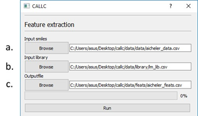
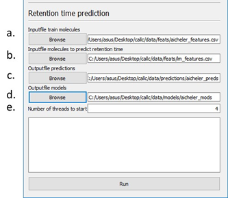
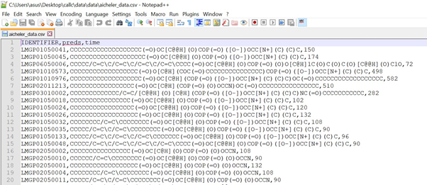
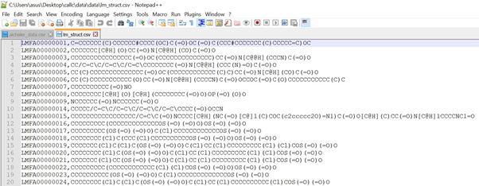
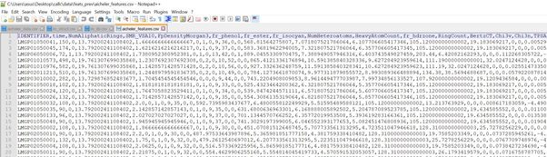
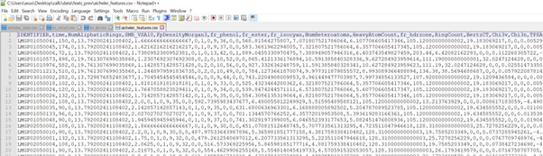
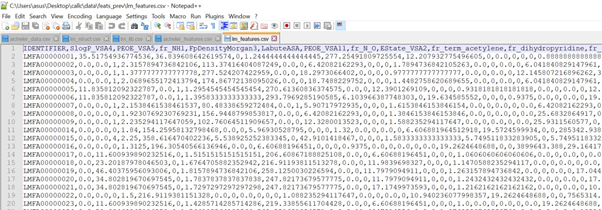

# CALLC

Installing and running CALLC is very easy. The tool provided was tested on windows and linux platforms, but for linux it is assumed you can install the required packages yourself (see the .yml in the install folder). If you have any further questions, feel free to send your questions to: robbin.bouwmeester@ugent.be

## Installation

To install CALLC double click on:

```install/install.bat```

## Generating predictions

1.	Run CALCC.vbs in the root (main directory)
2.	Extract features for your train set and prediction set you want to make predictions on. This is the top panel in the user interface.
    a.	Specify the location of the dataset. Train set has three columns: identifiers, SMILES and the experimentally measured retention time (see input and output files examples section for details). The set to make predictions on (e.g. LIPIDMAPS smiles in the folder rt/datasets/) has two columns: identifiers and SMILES. 
    b.	Specify a library with the SMILES structure in the first column and following columns contain the features that are extracted. Defining a library can significantly speed up the process of feature extraction when the process was already performed on a part of the dataset. 
    c.	Define an output file. 



3.	Run predictions 
    a.	Specify the input train set file with features extracted from step one 
    b.	Specify the dataset to make predictions on from step one 
    c.	Specify the output file for predictions 
    d.	Specify the output files for models. If you want to use these models in future for calibration specify it in the folder rt/mods_l1/ 
    e.	Specify the number of threads to use for fitting the model parameters 



## Input and output files examples 

### Feature extraction examples

Train file:


Prediction file:


Library file:


### Prediction examples

Input file train:


Input file predictions:


Output file predictions:

